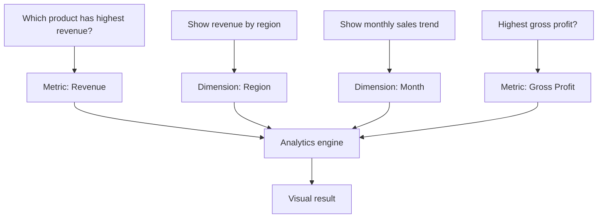
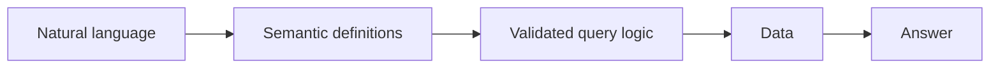

# AI Data Analytics Assistant

> A business-facing data + AI teaching demo: turn a natural-language question into governed analytics.  
> **Synthetic data · No API key · No database credential**

## From question to insight


## Dashboard concept

| KPI | Definition |
|---|---|
| Revenue | Quantity × Unit price |
| Cost | Quantity × Unit cost |
| Gross profit | Revenue − Cost |



## Questions available in the demo

**Product performance** — Which product has the highest revenue?  
**Regional analysis** — Show revenue by region.  
**Trend analysis** — Show monthly sales trend.  
**Profitability** — Which product has the highest gross profit?

The Streamlit app displays headline KPIs, a result table and a chart from the same governed metric definitions.

## Why this matters for AI analytics



The baseline deliberately uses deterministic routing. This makes it possible to explain the next step—Text-to-SQL—without pretending that unrestricted LLM-generated SQL is automatically safe.

## Quick start
```bash
python -m venv .venv
pip install -r requirements.txt
python src/generate_sales.py
streamlit run app.py
```

## Teaching roadmap
Deterministic routing → semantic layer → DuckDB → Text-to-SQL → SQL validation → execution → audit

## Topics I can teach
KPI design · dimensions and metrics · pandas aggregation · visualization · semantic layer · natural-language analytics · Text-to-SQL concepts · AI guardrails

## Privacy & security
The dataset is fully synthetic. No API keys, credentials, private database connections or company information are included.