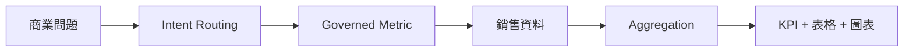
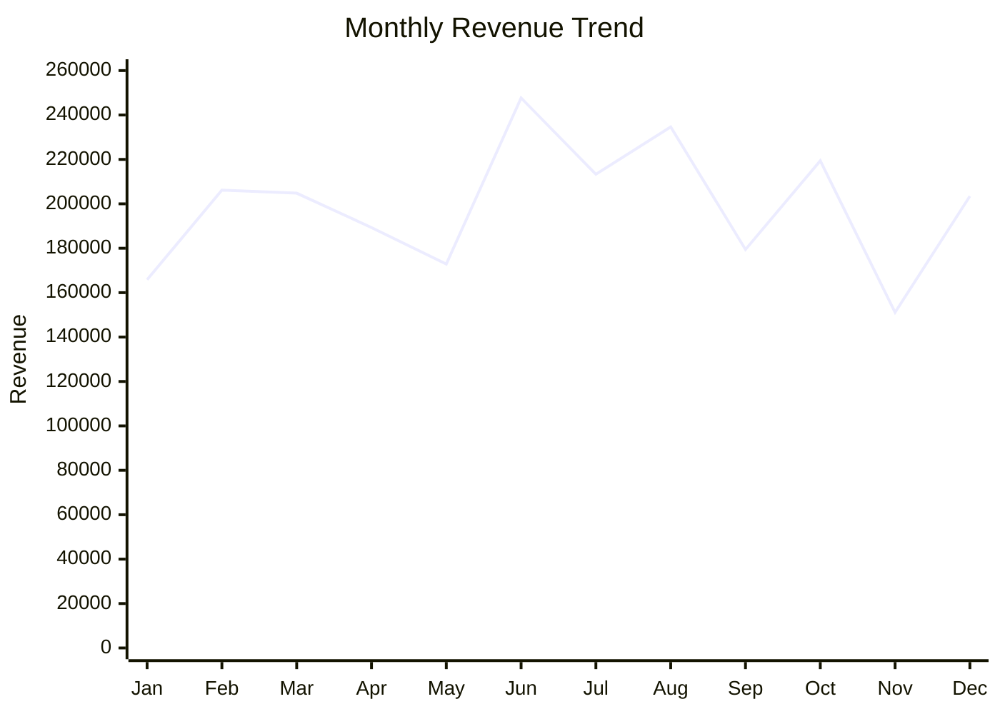

# AI 資料分析助理

[English](README.md) | **繁體中文**

> 從自然語言商業問題走到受治理的資料分析結果，展示 Data + AI 的實務流程。  
> **合成資料 · 不需要資料庫帳密**

## 從問題到商業洞察


## KPI 定義
| KPI | 定義 |
|---|---|
| Revenue | Quantity × Unit Price |
| Cost | Quantity × Unit Cost |
| Gross Profit | Revenue − Cost |

## 實際 Dashboard 結果
以下結果由 1,800 筆合成銷售資料（固定 random seed = 7）實際計算。

| Product | Revenue |
|---|---:|
| Laptop | 1,586,642 |
| Monitor | 481,869 |
| Headset | 189,625 |
| Keyboard | 129,852 |

### 每月 Revenue


## 為什麼先使用 Deterministic Routing？
此版本先使用 deterministic routing，讓分析結果可重現。接著可延伸到 Text-to-SQL，討論 Semantic Layer、SQL Validation 與 AI Guardrails。

## 執行方式
```bash
python -m venv .venv
pip install -r requirements.txt
python src/generate_sales.py
streamlit run app.py
```

## 教學延伸路線
Deterministic Routing → Semantic Layer → DuckDB → Text-to-SQL → SQL Validation → Execution → Audit

## 資料安全
資料集完全由程式產生，不含私人資料庫連線資訊或公司內部資料。
